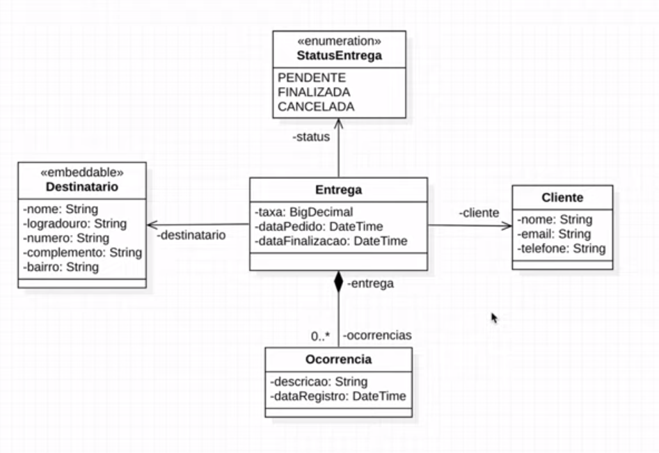

# Semana Spring REST AlgaWorks 
 

# Sobre o projeto

API REST desenvolvida com SpringFramework e HTML/CSS/Javascript no front-end. Essa aplicação esta baseada no diagrama UML abaixo - semana Mergulho Spring REST (AlgaWorks).

## UML - Modelo conceitual

## Executando o projeto
- git clone https://github.com/willhc1984/algawork_spring-rest
- cd algawork_spring-rest
- docker build -t spring-app .
- docker run -p 8080:8080 spring-app

# Tecnologias utilizadas
## Back end
- Java 17
- Spring Boot 2.7.1
- JPA / Hibernate
- Maven
- Banco de dados H2.
- Spring Tool Suite 4

## Front end
- HTML/CSS/Javascript
- Bootstrap/Jquery

# Autor

William Henrique Campos

https://www.linkedin.com/in/william-henrique-campos-98568813a/

